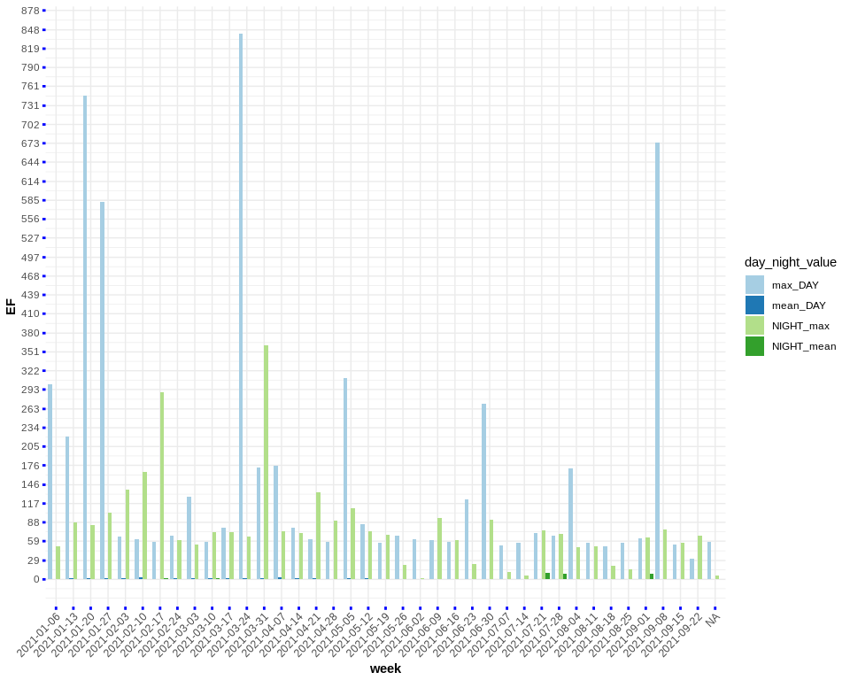
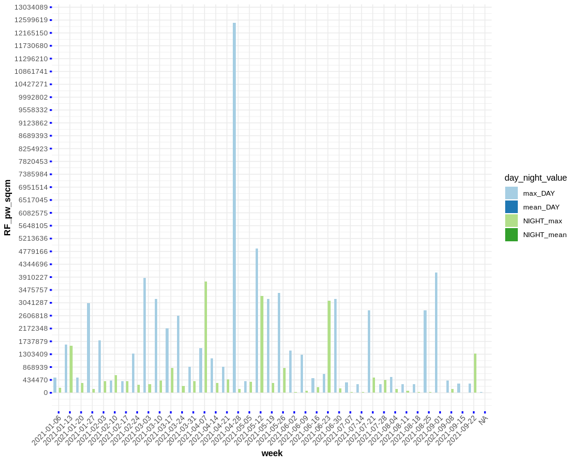

<!-- README.md is generated from README.Rmd. Please edit that file -->

```{r, echo = FALSE, include = FALSE}
knitr::opts_chunk$set(
  fig.path = "man/figures/README-",
  out.width = "100%"
)
```


## GqEmf390RadiationDetector

<br>

This R-package includes mainly data uploaded from my personal [GQ EMF-390](https://www.gqelectronicsllc.com/comersus/store/comersus_viewItem.asp?idProduct=5678) meter device to measure **EMF** (*Electromagnetic Field Radiation*), **EF** (*Electric Field Radiation*) and **RF** (*Radio Frequency Radiation*). 

You can read how [harmful EMF can be for the human health in this article](https://www.healthline.com/health/emf#TOC_TITLE_HDR_1), for instance mentioned *symptoms* can be:

* sleep disturbances, including insomnia
* headache
* depression and depressive symptoms
* tiredness and fatigue
* dysesthesia (a painful, often itchy sensation)
* lack of concentration
* changes in memory
* dizziness
* irritability
(among others)

<br>

If you want to go one step further you can read about [microwave weapons](https://www.nytimes.com/2018/09/01/science/sonic-attack-cuba-microwave.html) that a few nations employ to negatively affect the **human mind**. Related to the latter is the [Havana Syndrom](https://en.wikipedia.org/wiki/Havana_syndrome) which caused a disturbance worldwide.

<br>

The following visualization shows the measurements of the **3 radiation meters** along time (I've added also my **measurement location which is currently in Zografou, Athens, Greece**). I've **aggregated** the data **by day** and I computed the **mean** and **max** value for each one of the variables:

<br>

```{r, eval = TRUE, echo = FALSE}

#########################################################################################
#                              !!!!!! IMPORTANT !!!!!!!!! 
#                              ##########################
# Currently the Rust package does not return the correct YEAR, therefore I have to pass 
# the YEAR of the .csv file name to the data.table so that the correct year is displayed
#########################################################################################

dir_pth = system.file('emf_rf_ef_data', package = 'GqEmf390RadiationDetector')
lst_csvs = list.files(dir_pth, full.names = T, pattern = '.csv')
dat = lapply(1:length(lst_csvs), function(x) {
    
    #...................................................... Extract the year from the file name
    tmp_str = strsplit(basename(lst_csvs[x]), '_')[[1]]
    tmp_str = tmp_str[length(tmp_str)]
    tmp_str = strsplit(tmp_str, '[.]')[[1]]
    tmp_str = as.numeric(tmp_str[length(tmp_str)-1])
    #......................................................
    
    df = data.table::fread(lst_csvs[x], header = F, stringsAsFactors = F, nThread = parallel::detectCores())
    df$V1 = NULL
    colnames(df) = c('Date_Time', 'EMF', 'EF', 'RF_mw_sqm', 'RF_mw_sqcm', 'RF_pw_sqcm')                        # For more info on the column names SEE:  https://gitlab.com/codref/em390cli/-/blob/master/src/main.rs#L277
    df$Date_Time = lubridate::ymd_hms(df$Date_Time)
    lubridate::year(df$Date_Time) = rep(tmp_str, length(df$Date_Time))                                         #  !!!!!!! replace the YEAR with the year of the file name
    
    df$Date_Time = as.Date(df$Date_Time)                                                                       #  !!!! COMMENT THIS LINE OUT if I want to include also the time
    df
})

dat = data.table::rbindlist(dat)
not_dups = !duplicated(dat)
dat = dat[not_dups, , drop = F]
dat = dat[order(dat$Date_Time, decreasing = T), ]

dat_mean = dat[, .(EMF = mean(EMF),
              EF = mean(EF),
              RF_pw_sqcm = mean(RF_pw_sqcm)),
          by = 'Date_Time']

dat_mean$Value = rep('MEAN', nrow(dat_mean))

dat_max = dat[, .(EMF = max(EMF),
              EF = max(EF),
              RF_pw_sqcm = max(RF_pw_sqcm)),
          by = 'Date_Time']

dat_max$Value = rep('MAX', nrow(dat_max))

dat_all = rbind(dat_mean, dat_max)


require(ggplot2)

GGPLOT = function(inp_data, radiation_method) {
  
  inp_data$Date_Time = as.factor(inp_data$Date_Time)
  
  gg_plt = ggplot(data=inp_data, aes(x=Date_Time, y=inp_data[[glue::glue("{radiation_method}")]], fill=Value)) +
    geom_bar(stat="identity", position=position_dodge()) +
    scale_fill_brewer(palette="Paired") +
    theme_minimal() +
    ylab(radiation_method) +
    theme(axis.title.y = ggplot2::element_text(size = 11, face="bold", colour = "black"),
          strip.text.y = ggplot2::element_text(size = 11, face="bold", colour = "black"),
          axis.title.x = ggplot2::element_text(size = 11, face="bold", colour = "black"),
          axis.text.x = ggplot2::element_text(angle = 45, vjust = 0.5, hjust = 1))
  
  return(gg_plt)
}

```


```{r plotly-EMF-figure, eval = TRUE, echo = FALSE, warning = F, message = F, dev = "png", fig.height = 8, fig.width = 10, fig.show = "hide"}

# Vizualization EMF

plt_emf = GGPLOT(inp_data = dat_all, radiation_method = 'EMF')
plt_emf

```


```{r plotly-EF-figure, eval = TRUE, echo = FALSE, warning = F, message = F, dev = "png", fig.height = 8, fig.width = 10, fig.show = "hide"}

# Vizualization EF

plt_ef = GGPLOT(inp_data = dat_all, radiation_method = 'EF')
plt_ef

```


```{r plotly-RF-figure, eval = TRUE, echo = FALSE, warning = F, message = F, dev = "png", fig.height = 8, fig.width = 10, fig.show = "hide"}

# Vizualization RF

plt_rf = GGPLOT(inp_data = dat_all, radiation_method = 'RF_pw_sqcm')
plt_rf

```

<br>

#### Vizualization **EMF** (*Electromagnetic Field Radiation*)

<br>


<br>

#### Vizualization **EF** (*Electric Field Radiation*)

<br>



<br>

#### Vizualization **RF** (*Radio Frequency Radiation*)

<br>




```{r Leaflet-Map, eval = FALSE, echo = FALSE, warning = F, message = F}

#...............................................................................................................................................................
# Keep this as a reference to create the .html file and run this code snippet only once to save the .html file in the 'inst' directory (from where I'll load it)
# save the leaflet map as an .html file [ see: https://github.com/ramnathv/htmlwidgets/issues/299#issuecomment-375058928 ]
#...............................................................................................................................................................

saveWidgetFix <- function (widget,file,...) {

  wd <- getwd()
  on.exit(setwd(wd))
  outDir <- dirname(file)
  file <- basename(file)
  setwd(outDir);
  htmlwidgets::saveWidget(widget, file = file,...)
}


gj_file = system.file('Zografou_Athens_Greece.geojson', package = 'GqEmf390RadiationDetector')
pnt_obj = geojsonR::FROM_GeoJson(gj_file, Flatten_Coords = T, Average_Coordinates = T)
average_coords = pnt_obj$leaflet_view_coords
geometry_dump = pnt_obj$geometry_dump
lft = leaflet::leaflet()
lft = leaflet::addProviderTiles(map = lft, provider = leaflet::providers$Esri.WorldImagery, group = leaflet::providers$Esri.WorldImagery)
lft = leaflet::addProviderTiles(map = lft, provider = leaflet::providers$OpenStreetMap, group = leaflet::providers$OpenStreetMap)
lft = leaflet::setView(lft, lng = average_coords[1], lat = average_coords[2], zoom = 18)
lft <- leaflet::addProviderTiles(lft, leaflet::providers$Esri.WorldImagery)
lft = leaflet.extras::addGeoJSONv2(lft, geometry_dump, 
                                   popupProperty = 'popup',                              # the geojson file must contain in the properties this attribute
                                   labelProperty = 'Argonafton, Zografou, Athens',
                                   highlightOptions = leaflet::highlightOptions(weight = 2, color = "#000000",
                                                                                fillOpacity = 1, opacity = 1,
                                                                                bringToFront = TRUE, sendToBack = TRUE))
lft = leaflet::addLayersControl(map = lft,
                                baseGroups = leaflet::providers$Esri.WorldImagery,
                                overlayGroups = leaflet::providers$OpenStreetMap,
                                options = leaflet::layersControlOptions(collapsed = FALSE),
                                position = "topright")

# html_path = file.path(getwd(), 'man/figures/my_location.html')
html_path = 'my_location.html'
saveWidgetFix(widget = lft, file = html_path, selfcontained = TRUE)

```


<br>

[Click here to view the Location (Zografou, Athens, Greece) on Browser](https://raw.githack.com/mlampros/GqEmf390RadiationDetector/master/inst/my_location.html)

<br>


<br>

## Installation Instructions and Usage

<br>

The configuration is tested only on a Linux Machine and the installation requires the following steps:

* First download the **.tar.gz** file from https://gitlab.com/codref/em390cli
* Then extract the .tar.gz and rename the directory to **em390cli**
* Then make **em390cli** the default directory using 
    * cd /ADJUST_PATH_OF_YOUR_PC/em390cli
* Then build using **cargo**. If you don't have **cargo** then install it based on [https://jeroen.github.io/erum2018/#7](https://jeroen.github.io/erum2018/#7)
    * sudo apt-get install cargo
    * cargo build
* Once build successfully an additional **target** directory will be created which I'll have to overwrite in the previously mentioned **emf390cli** using:
    * cp target/debug/emf390cli build/x86-linux/
* Then create a directory to save the output **.csv files**:
    * cd 
    * mkdir /ADJUST_PATH_OF_YOUR_PC/DIR_SAVE_CSV
* Then download all data from the **GQ_EMF_390** flash memory as mentioned in the documentation [https://gitlab.com/codref/em390cli#retrieve-data-stored-inside-the-unit-memory](https://gitlab.com/codref/em390cli#retrieve-data-stored-inside-the-unit-memory) using (**Make sure** that the **/dev/ttyUSB0** shortcut **exists** after you **connect your device** and **before executing** the following commands, so that the data can be saved to the .csv file):
    * cd /ADJUST_PATH_OF_YOUR_PC/em390cli/build/x86-linux/
    * sudo ./emf390cli -p /dev/ttyUSB0 -d /home/lampros/Desktop/GQ_EMF_390_Radiation_Detector/DIR_SAVE_CSV/todays_data.csv
* The data can be loaded in any programming languages using a .csv reader

<br>

**Reference (and credits to):**

* https://gitlab.com/codref/em390cli

<br>


<br>
