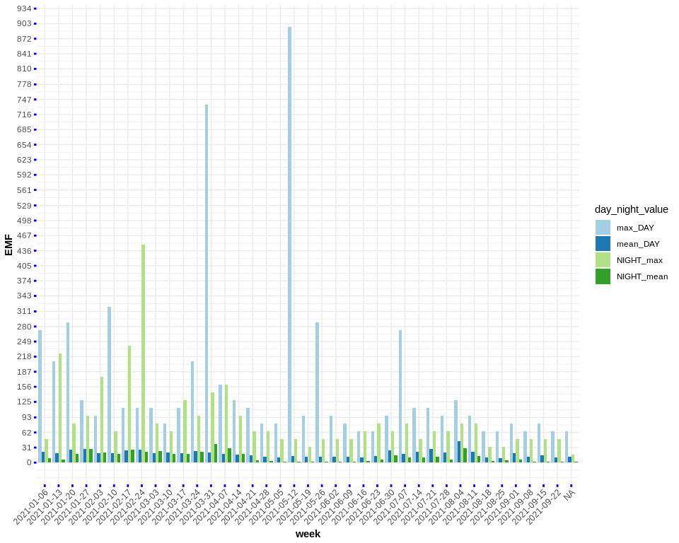
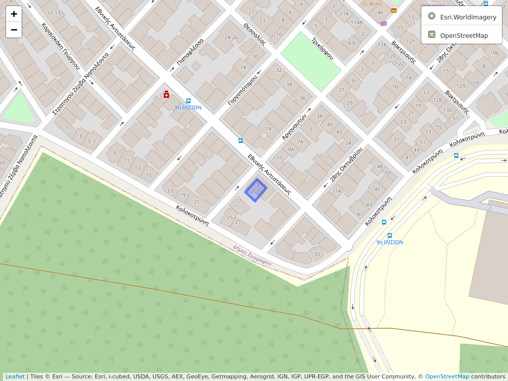

<!-- README.md is generated from README.Rmd. Please edit that file -->

GqEmf390RadiationDetector
-------------------------

 

This R-package includes mainly data uploaded from my personal [GQ
EMF-390](https://www.gqelectronicsllc.com/comersus/store/comersus_viewItem.asp?idProduct=5678)
meter device to measure **EMF** (*Electromagnetic Field Radiation*),
**EF** (*Electric Field Radiation*) and **RF** (*Radio Frequency
Radiation*).

You can read how [harmful EMF can be for the human health in this
article](https://www.healthline.com/health/emf#TOC_TITLE_HDR_1), for
instance mentioned *symptoms* can be:

-   sleep disturbances, including insomnia
-   headache
-   depression and depressive symptoms
-   tiredness and fatigue
-   dysesthesia (a painful, often itchy sensation)
-   lack of concentration
-   changes in memory
-   dizziness
-   irritability (among others)

 

If you want to go one step further you can read about [microwave
weapons](https://www.nytimes.com/2018/09/01/science/sonic-attack-cuba-microwave.html)
that a few nations employ to negatively affect the **human mind**.
Related to the latter is the [Havana
Syndrom](https://en.wikipedia.org/wiki/Havana_syndrome) which caused a
disturbance worldwide.

 

The following visualization shows the measurements of the **3 radiation
meters** along time (I’ve added also my **measurement location which is
currently in Zografou, Athens, Greece**). I’ve **aggregated** the data
**by day** and I computed the **mean** and **max** value for each one of
the variables:

 

    ## Loading required package: ggplot2

 

#### Vizualization **EMF** (*Electromagnetic Field Radiation* separated by *Day* and *Night* values)

 

 

#### Vizualization **EF** (*Electric Field Radiation* separated by *Day* and *Night* values)

 

 

#### Vizualization **RF** (*Radio Frequency Radiation* separated by *Day* and *Night* values)

 

 

[Click here to view the Location (Zografou, Athens, Greece) on
Browser](https://raw.githack.com/mlampros/GqEmf390RadiationDetector/master/inst/my_location.html)

 

  

Installation Instructions and Usage
-----------------------------------

 

The configuration is tested only on a Linux Machine and the installation
requires the following steps:

-   First download the **.tar.gz** file from
    <a href="https://gitlab.com/codref/em390cli" class="uri">https://gitlab.com/codref/em390cli</a>
-   Then extract the .tar.gz and rename the directory to **em390cli**
-   Then make **em390cli** the default directory using
    -   cd /ADJUST\_PATH\_OF\_YOUR\_PC/em390cli
-   Then build using **cargo**. If you don’t have **cargo** then install
    it based on <https://jeroen.github.io/erum2018/#7>
    -   sudo apt-get install cargo
    -   cargo build
-   Once build successfully an additional **target** directory will be
    created which I’ll have to overwrite in the previously mentioned
    **emf390cli** using:
    -   cp target/debug/emf390cli build/x86-linux/
-   Then create a directory to save the output **.csv files**:
    -   cd
    -   mkdir /ADJUST\_PATH\_OF\_YOUR\_PC/DIR\_SAVE\_CSV
-   Then download all data from the **GQ\_EMF\_390** flash memory as
    mentioned in the documentation
    <https://gitlab.com/codref/em390cli#retrieve-data-stored-inside-the-unit-memory>
    using (**Make sure** that the **/dev/ttyUSB0** shortcut **exists**
    after you **connect your device** and **before executing** the
    following commands, so that the data can be saved to the .csv file):
    -   cd /ADJUST\_PATH\_OF\_YOUR\_PC/em390cli/build/x86-linux/
    -   sudo ./emf390cli -p /dev/ttyUSB0 -d
        /home/lampros/Desktop/GQ\_EMF\_390\_Radiation\_Detector/DIR\_SAVE\_CSV/todays\_data.csv
-   The data can be loaded in any programming languages using a .csv
    reader

 

**Reference (and credits to):**

-   <a href="https://gitlab.com/codref/em390cli" class="uri">https://gitlab.com/codref/em390cli</a>

 
